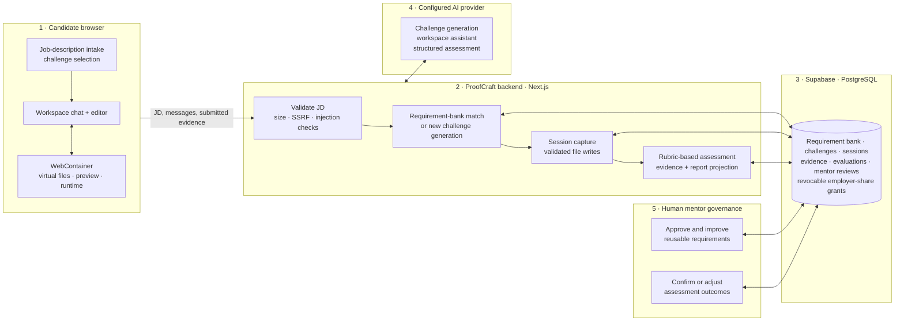

# ProofCraft

ProofCraft is a browser-first work-sample assessment platform for candidates using AI to build software. It turns a job description into a structured challenge, captures candidate decisions and submitted work, produces an evidence-based assessment, and keeps a human mentor responsible for high-stakes review.

## Current architecture



### How the five components work

1. **Candidate browser** — The candidate pastes a job description, completes the challenge, and works in an in-browser editor. WebContainer supplies the virtual file system, preview, and runtime locally in the browser.
2. **ProofCraft backend** — Next.js validates job descriptions, chooses a requirement-bank match or generates a new challenge, records session evidence, and creates reports.
3. **Supabase PostgreSQL** — Stores structured requirements, challenges, sessions, file snapshots, assessments, mentor decisions, and revocable employer-sharing records.
4. **Configured AI provider** — Generates challenges, supports the workspace assistant, and produces structured rubric-based assessment proposals from submitted evidence.
5. **Human mentor governance** — Mentors approve reusable requirements and can confirm or adjust assessment outcomes. The product does not make a final high-stakes decision automatically.

## Browser-first scaling model

WebContainer keeps the interactive editor, virtual files, preview, and runtime on the candidate's device. The backend therefore focuses on stateless orchestration, persistence, and model requests rather than running a server-side container for every candidate.

This is a scalable architecture, not an "infinite scale" claim: model calls, database capacity, mentor availability, and provider quotas remain operational constraints. Candidate messages and submitted evidence are still sent to the backend for assessment and review.

## Assessment boundaries

- A submitted assessment preserves its recorded evidence and SFIA level rather than recalculating it when a report is opened.
- Employer sharing uses a revocable, time-limited capability and a minimised dossier. It does not expose transcript messages, workspace files, private contest notes, or model reasoning.
- Evidence checks and mentor review inform the outcome. A mentor remains the authority for review and overrides.

## Jev status

Jev is **not integrated into the current product**. It was evaluated only as a possible future shadow claim-to-evidence checker. If adopted, it would flag potentially unsupported claims for mentor review; it would not score candidates, replace a mentor, or make a hiring decision.

## Local development

Copy the required environment values into a local `.env` file, then run:

```bash
npm install
npx prisma migrate deploy
npm run dev
```

For release checks:

```bash
npx next typegen
npm run typecheck
npm test
npm run build
```

## Deployment note

The schema migration under `prisma/migrations/` must be applied before deployment. The verified integration work is on the `codex/final-assessment-trust` branch and should be merged into the intended release branch before Vercel or Fly deployment.
